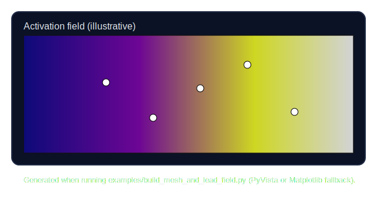

Examples
========

Build a myocardial mesh and lead field
--------------------------------------

The repository bundles a guided quickstart in two formats:

* :download:`00_build_mesh_and_lead_field.ipynb <../00_build_mesh_and_lead_field.ipynb>`
  walks through mesh loading, Purkinje UV tree ingestion, PMJ embedding, lead-field
  computation, and PyVista visualization.
* ``examples/build_mesh_and_lead_field.py`` is a CLI-friendly version that can run
  headless smoke tests (``--skip-plot``) or emit a screenshot by default.

Run the script end-to-end from the repository root:

.. code-block:: bash

   python examples/build_mesh_and_lead_field.py --sample-pmjs 256

To exercise only the numerical steps in CI, disable plotting:

.. code-block:: bash

   python examples/build_mesh_and_lead_field.py --skip-plot

Reference implementation
------------------------

.. literalinclude:: ../examples/build_mesh_and_lead_field.py
   :language: python
   :caption: CLI helper for the build-mesh-and-lead-field walkthrough
   :linenos:

Sample output
-------------

   Off-screen render of the activation field produced by the example script (PyVista when
   available; Matplotlib fallback shown here).

If the runtime lacks OpenGL or Xvfb support, the script automatically falls back to a
Matplotlib snapshot while still attempting PyVista first.
